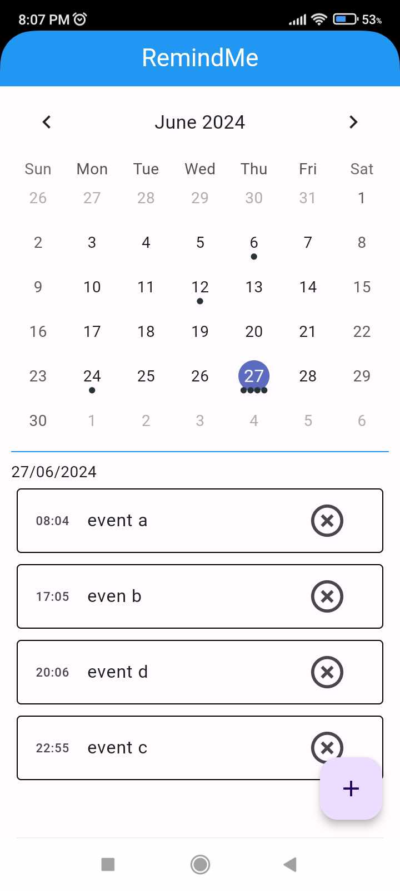

# remindme
## Description
This a calendar app written in dart with Flutter. you can view the calendar and add events. It uses an SQLite database to store the event data.



## How To run
This app was only tested on Android devices, but could work on other platforms.

```
cd remindme
flutter run
```